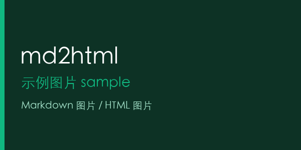

# 示例文章

这是一段普通正文，用来验证 Markdown 转 HTML。

> [!NOTE]
> 这是一个提示块。

<details>
  <summary>展开说明</summary>
  <p>这是折叠内容，在 wechat/km/lexiang 中会降级为静态内容。</p>
</details>




```ts
const message = "hello";
console.log(message);
```

| 项目 | 状态 |
| --- | --- |
| 图片 | 已复制 |
| 样式 | 已内联 |
